# End-to-End-Data-Pipeline-using-Databricks-Medallion-Architecture-
---
# Problem Definition

Many organizations still rely on on-premise systems that generate raw CSV data. In this project, I worked with such a dataset that contained multiple data quality issues, including inconsistencies, duplicate records, incorrect data types, and invalid values such as nulls, zeros, and negative entries where they should not exist.

Additionally, the dataset included related tables with conflicting values and inconsistent keys, making it difficult to perform accurate joins and derive meaningful insights.

Without proper processing and structure, this type of data is not suitable for business analytics and prevents organizations from generating reliable, data-driven decisions.

## Objective
The goal of this project is to design and implement an end-to-end data pipeline using the Databricks platform. The pipeline ingests raw CSV data from lakehouse volumes into structured tables and applies transformations using the Medallion Architecture (Bronze, Silver, Gold).

By leveraging Delta Lake and lakehouse principles, the system produces clean, consistent, and analytics-ready datasets. The pipeline is fully automated to run daily, ensuring reliable and up-to-date data availability.

## 📂 Data Description - About the data
The dataset represents typical CRM and ERP systems, including customer, product, and sales data. It contains common real-world data quality issues such as missing values, duplicate records, inconsistent formats, and conflicting keys across related tables.

These characteristics make it suitable for demonstrating data ingestion, cleaning, transformation, and modeling in a production-style pipeline.

## 📦 Scope Definition
This project includes:
- Batch ingestion (CSV → Delta format)
- Data cleaning and transformation
- Data modeling using fact and dimension tables
- Pipeline orchestration (daily scheduled runs at 15:00 Toronto time)
- Pipeline monitoring and failure notifications

This project does not include:
- Real-time or streaming data processing

This project is focused on batch data processing and structured transformation rather than real-time ingestion.

## ✅ Success Criteria
- Data is ingested daily without failure, with automated notifications for pipeline start, success, and failure
- Bronze layer preserves raw data accurately for traceability
- Silver layer resolves inconsistencies, removes duplicates, and standardizes data
- Gold layer produces reliable, analytics-ready datasets using a star schema with fact and dimension tables
- Slowly Changing Dimensions (Type 2) are implemented where applicable
- Pipeline runs automatically with correctly defined dependencies

Key Concepts
- Medallion Architecture: A layered data design pattern that improves data quality and structure across Bronze (raw), Silver (cleaned), and Gold (business-ready) layers
- Delta Lake: Provides ACID transactions, schema enforcement, and versioning (data history) for reliable and consistent data processing
- Lakehouse Architecture: Combines the scalability of data lakes with the structure and performance of data warehouses

--- 

#  Architecture Overview
The architecture follows a layered lakehouse design that ingests raw data from on-premise systems and processes it through Bronze, Silver, and Gold layers using the Medallion Architecture.

Raw CSV data is first stored in lakehouse volumes before being ingested into Delta tables. Each layer performs a specific role: the Bronze layer preserves raw data, the Silver layer ensures data quality through cleaning and standardization, and the Gold layer applies business logic to produce analytics-ready datasets.

Pipeline orchestration is implemented to automate daily batch processing, ensuring reliable and consistent data delivery.

### Pipeline Orchestration Diagram 
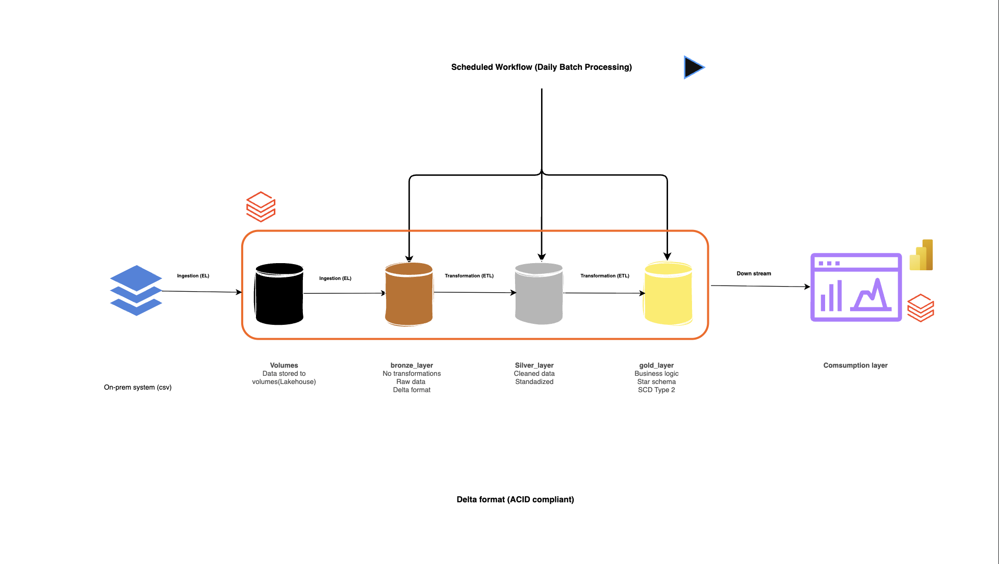

## LAYER BREAKDOWN 
Bronze Layer: Raw data ingestion from CSV files with schema applied. Data is stored in Delta format without transformations to preserve source integrity.

Silver Layer: Data is read from the Bronze layer and cleaned by removing duplicates, handling null values, standardizing formats, and applying data type conversions.

Gold Layer: Business logic is applied through joins and aggregations to create analytics-ready datasets. Data is modeled using a star schema with fact and dimension tables, including Slowly Changing Dimension (Type 2) implementation.

## Dataflow Diagram
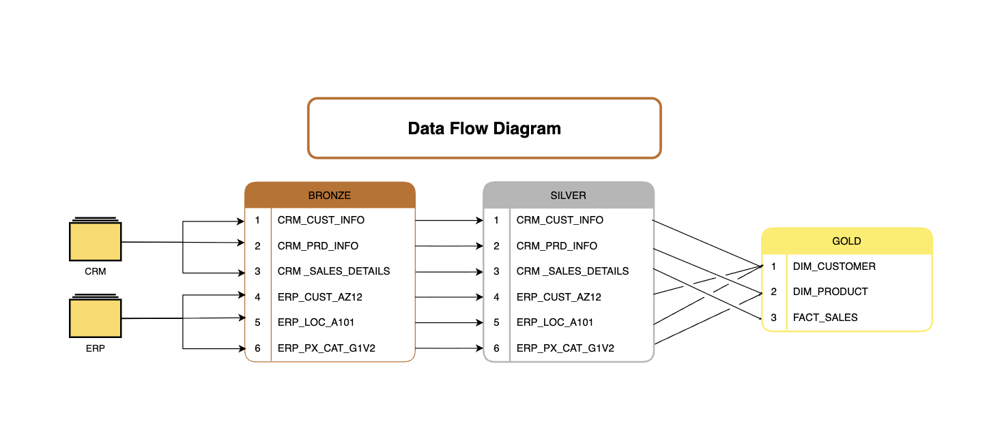

## Data Preview (Screenshots)
### Bronze Layer: Raw ingested data in Delta format

#### Bronze crm_customer_info table
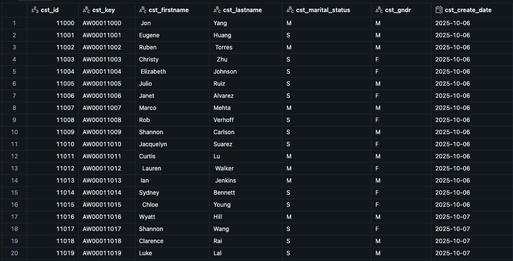

#### Bronze crm_product_info table
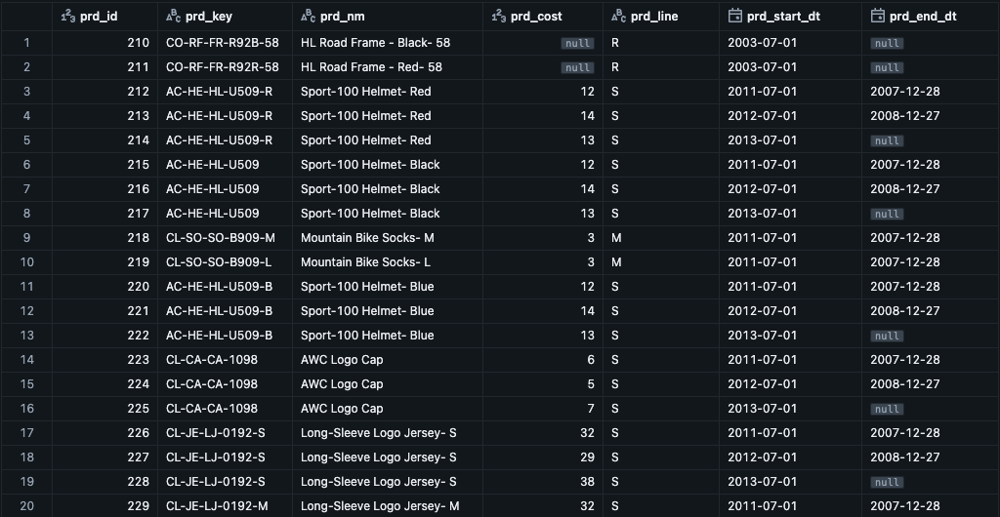

#### Bronze crm_sales_details table
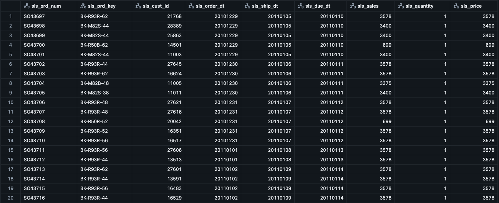

#### Bronze erp_customer_az12 table
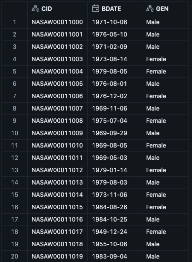

#### Bronze erp_location_a101 table
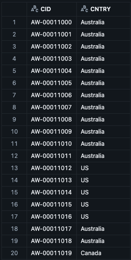

#### Bronze erp_product_category_g1v2 table
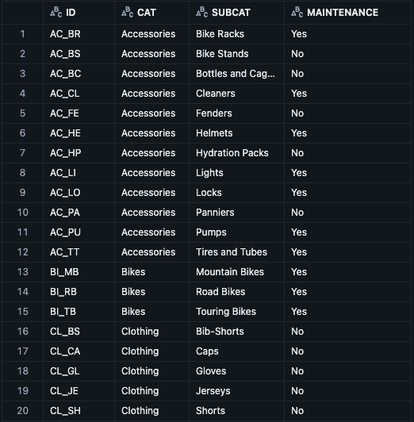

### Silver Layer: Cleaned and standardized dataset

#### Silver crm_customer_info table
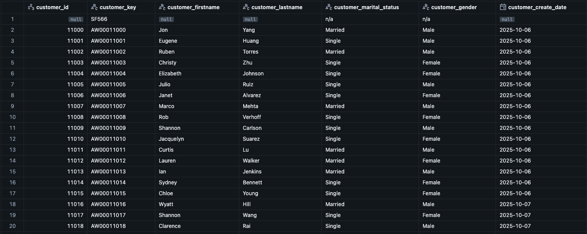

#### Silver crm_product_info table
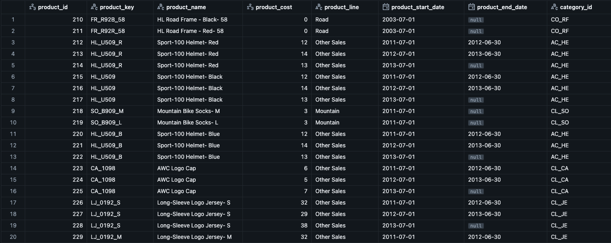

#### Silver crm_sales_details table
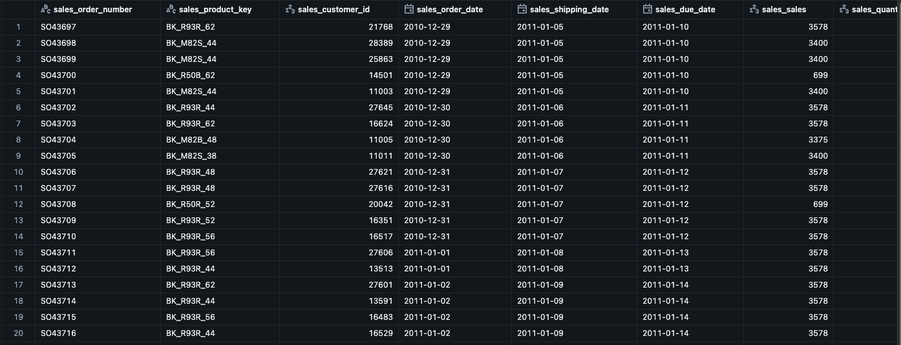

#### Silver erp_customer_az12 table
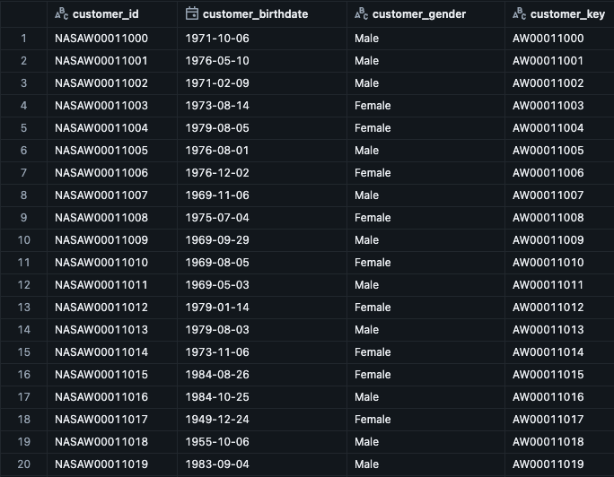

#### Silver erp_location_a101 table
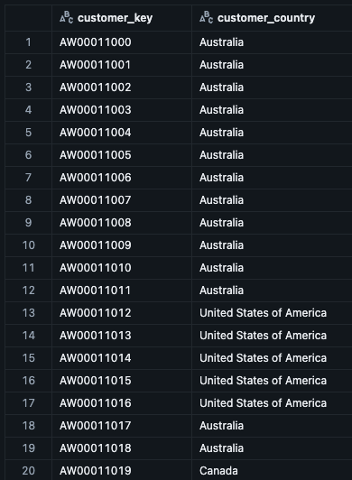

#### Silver erp_product_category_g1v2 table
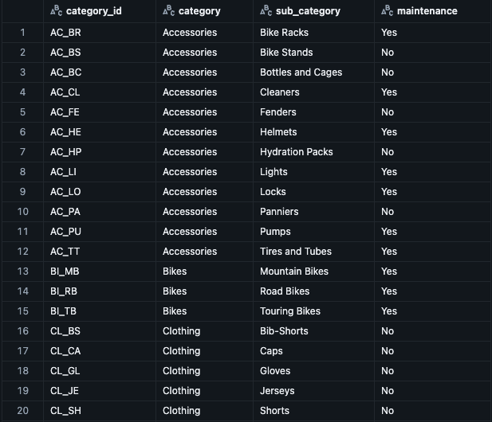

### Gold Layer: Final analytics-ready tables

#### Gold Customer Dimension table
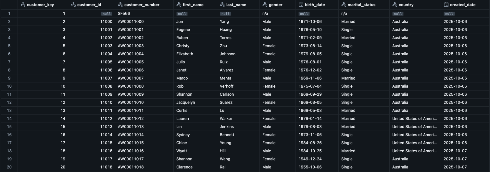

#### Gold Product Dimension table
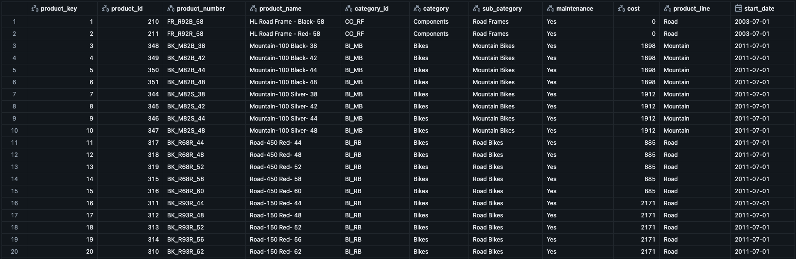

#### Gold Sale Fact table
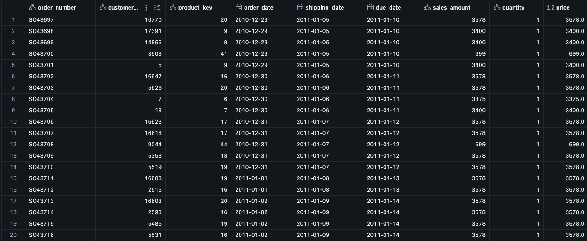

### Pipeline workflow UI and Dependency from Databricks job & pipelines: 
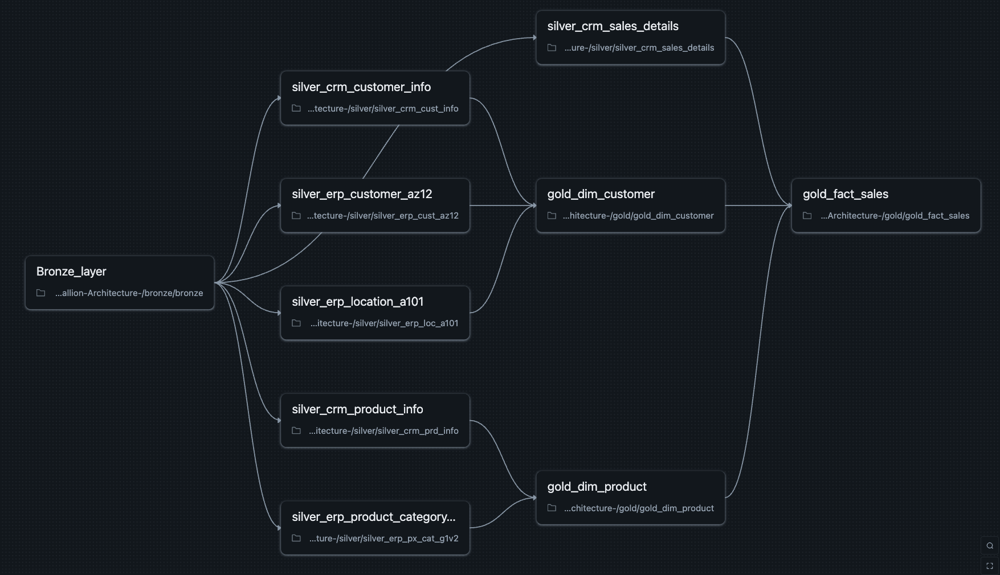

## Why Delta format?
Delta format was chosen to ensure reliable and consistent data processing. It provides ACID transactions to prevent data corruption, schema enforcement to maintain data integrity, and versioning capabilities that allow historical data tracking and recovery. These features make it well-suited for building scalable and production-ready data pipelines.

## Why medallion Architecture 
The Medallion Architecture was used to structure data processing into distinct layers—Bronze, Silver, and Gold—each serving a specific purpose. This approach improves data quality, enables easier debugging, and ensures scalability by separating raw data ingestion, data cleaning, and business logic transformations.

## Why Batch Processing? (Daily Ingestion Use Case)
Batch processing was chosen due to the periodic nature of the source data, which is generated as CSV files from on-premise systems. Since the business requirement focuses on daily analytics rather than real-time insights, a batch-based approach provides a more suitable solution.
This approach simplifies pipeline design, improves reliability through controlled execution, and reduces operational costs by avoiding always-on infrastructure. Additionally, scheduled batch processing allows for easier monitoring, debugging, and recovery in case of failures.

---

# Medallion Architecture (Bronze > Silver > Gold)
## 📥 Bronze Layer (Raw Ingestion)

The Bronze layer ingests raw data from on-premise CSV files into the lakehouse with no transformations. Its purpose is to preserve the original data structure, ensure traceability, and act as a reliable source for reprocessing.

Implementation

Raw CSV files are read using PySpark and stored as Delta tables:
### Config file to load data from volumes to delta table
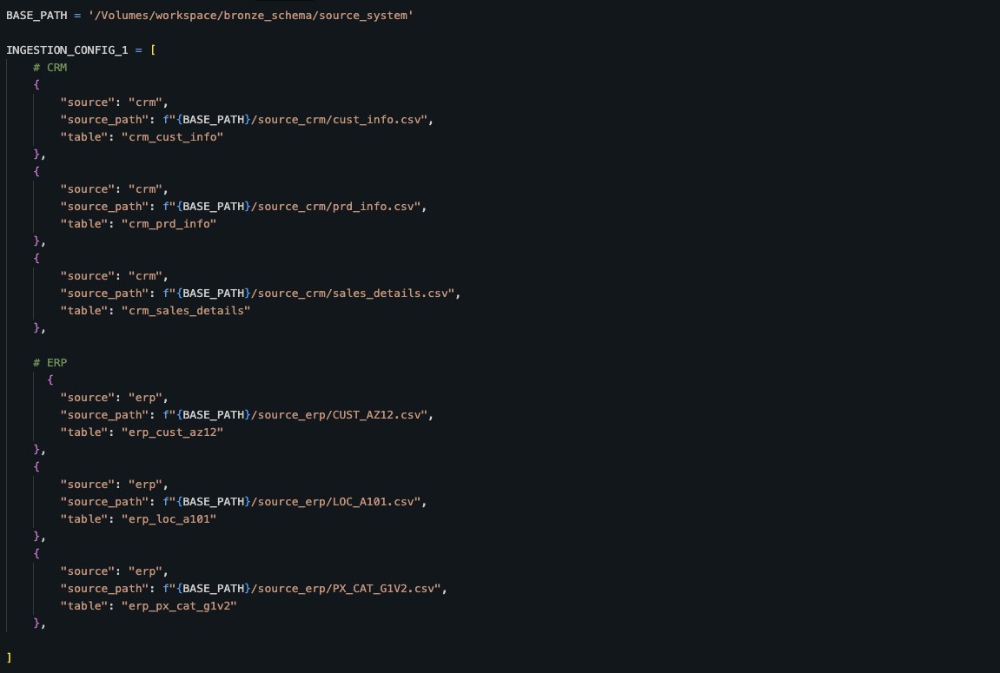

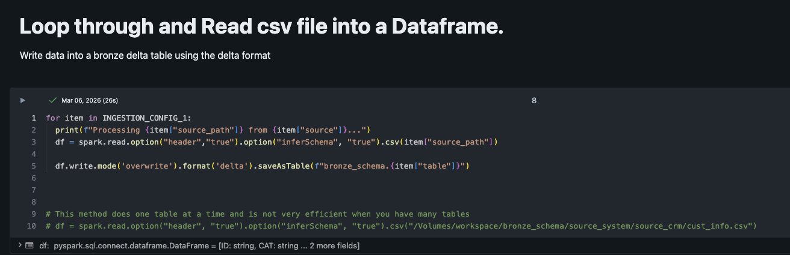

###  Design Decisions
No Transformations: Data is ingested and stored as-is to preserve source integrity and enable full traceability.

Delta Format: Data is stored in Delta format to leverage ACID transactions, schema enforcement, and improved read/write performance.

Schema Inference: Schema inference is used during ingestion to allow flexibility with varying source data, with the option to introduce stricter schema validation in future iterations.

Overwrite Mode: Overwrite mode is used to refresh the Bronze layer with the latest source data, ensuring consistency across pipeline runs.

 Key Insight: The Bronze layer acts as a single source of truth, allowing downstream layers to be rebuilt in case of failures.

   

## 🧹 Silver Layer (Multiple Tables Approach)

The Silver layer applies data cleaning and standardization across all ingested Bronze tables to ensure consistency, accuracy, and reliability for downstream processing.

Transformations Applied
- Removed duplicate records to ensure data uniqueness
- Handled missing/null values and empty strings to improve data completeness
- Trimmed leading and trailing whitespace for consistency
- Standardized data formats (e.g., dates, text casing)
- Corrected data types to align with the expected schema
- Filtered invalid values (e.g., negative or incorrect entries)
- Applied validation checks to enforce business rules (e.g., ensuring sales = price × quantity)

###  Table-Level Transformations

|Table: crm_cust_info | Key Issues Identified      | Transformations Applied                       |
|-------------------- |----------------------------|-----------------------------------------------|
||Duplicate values detected in cst_id (data integrity concern)| Applied window function to retrieve most recent customer information |
||Null values present across all columns except cst_id| Window function application fixed most of this issue|
||Whitespace issues in cst_firstname and cst_lastname|All string values were trimmed|
||Inconsistent categorical values in cst_marital_status and cst_gndr (abbreviations and lack of standardization)|Values mapped to more friendly values "s" - Single, "m" - Married, "f"-Female, "m"=Male|
||Column naming conventions are not standardized and require renaming|Columns renamed with withColumnsRenamed in pyspark|
||Other Nullable values need handling strategy| Replace with N/A where appropriate|

  
|Table: crm_prd_info | Key Issues Identified      | Transformations Applied                       |
|--------------------|----------------------------|-----------------------------------------------|
||Missing values in some columns| Handled null values using appropriate imputation / else n/a or 0|
||Whitespace in prd_line| All string values were trimmed|
||Unnormalized values in prd_line| "M" - Mountain, "R" - Road, "S" - Other Sales, "T" - Touring|
||Invalid date logic (end date before start date)| Filtered or corrected inconsistent date records following business rule|
||prd_cost values valid (positive > 0)|No transformation required|

  
|Table: crm_sales_details | Key Issues Identified      | Transformations Applied                       |
|-------------------- |----------------------------|-----------------------------------------------|
||Dates are of IntegerType | Converted to StringType then toDate|
||sls_order_dt has date where character length not equal to 8 | Replace with null|
||Negative or zero or null values found in sls_price and sls_sales column| Implemented business rule to ensure price * quantity = sales|
||data has rows where product of sls_price and sls_quantity is not equal to sls_sales| Implemented business rule to ensure price * quantity = sales|
||Sale_prd_key should match the prd_key from the prd_info table.. Currently sales_prd_key has "-" while prd_info prd_key has "_"| Character "-" was replaced with "_"|

  
|Table: erp_cust_az12 | Key Issues Identified      | Transformations Applied                       |
|-------------------- |----------------------------|-----------------------------------------------|
||GEN column has empty strings, null values, white spaces, and there are multiple variations of Male and Female| Empty strings and null values replaced with n/a. Gender values normalized "m" - Male, "f" - Female|
||Some CID does not match customer_key from crm_cust_info table as in accordance with the Entity Relationship Diagram (ERD). AW% Match but NAS% does not match|Slicing done to retrieve appropraite keys|
||Some BDATE are wrong as they are in the future (Greater than the curr_date)| Dates grether than current date replace with NULL|
||Columns are not properly named. Needs renaming|Columns renamed with withColumnsRenamed in pyspark|

  
|Table: erp_loc_a101  | Key Issues Identified      | Transformations Applied                       |
|-------------------- |----------------------------|-----------------------------------------------|
||Missing values(Null) and whitespace in the CNTRY column| White space trimmed, Missing values replace with n/a|
||CNTRY need remapping. Multiple variations of country found and Short code used in some countries| Country standadization applied. Make country variations to one value e.g US, USA, UNITED STATES all mapped to United States of America|
||Column names are not business user friendly|Columns renamed with withColumnsRenamed in pyspark
||CID key does not match customer_key in crm_cust_info table because CID has "-" in it. Hyphen needs to be removed| "-" removed (replaced with "")|

  
|Table: erp_px_cat_g1v2 | Key Issues Identified      | Transformations Applied                       |
|-----------------------|----------------------------|-----------------------------------------------|
||Data was clean|No major transformation needed |
||Columns needed renaming|Columns renamed with withColumnsRenamed in pyspark|

 Why It Matters: The Silver layer ensures data consistency, accuracy, and reliability, making it suitable for building trusted business logic in the Gold layer.

   

## 🏆 Gold Layer (Business Logic)

Purpose: 
The Gold layer transforms cleaned Silver data into business-ready datasets by applying joins, aggregations, and data modeling to support analytics and decision-making.

 Business Logic Applied
- Applied denormalization by joining multiple datasets to customers and products
- Replace foreign keys from fact with derived surrogate keys from dimensions after joining tables to ensure easy key retrieval 
- Performed aggregations 
- Modeled data into fact and dimension tables (star schema)
- Implemented Slowly Changing Dimensions (Type 2) where applicable

📊 Future gold layer query to answer business questions like: 
- What are the total sales per region?
- Who are the top customers by revenue?
- What products generate the highest sales?
- How does customer behavior change over time?

Data Model (Output) The final output is structured using a star schema:
Fact Table: 
- fact_sales (sales transactions)
Dimension Tables
- dim_customers
- dim_products

 Output: The Gold layer produces fully transformed, analytics-ready tables that can be directly consumed by BI tools for reporting and dashboarding.

 Business Value: The Gold layer converts raw and cleaned data into actionable insights, enabling data-driven decision-making through reliable and structured analytics datasets.

---

# Data Modeling
Purpose:
The data model is designed to organize data into a structured format that supports efficient querying and analytics.

⭐ Data Model Design:

The Gold layer follows a star schema, consisting of one central fact table connected to multiple dimension tables.

## Entity Relationship Diagram

Tool: draw.io

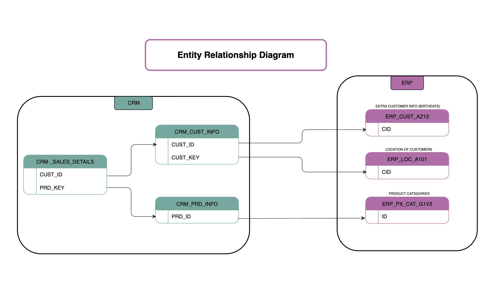

## Star Schema
Structure:
- Fact Table (center): 
  - fact_sales – stores transactional data such as sales amount, quantity, and keys to dimensions.
- Dimension Tables (around): 
  - dim_customers – customer details
  - dim_products – product information

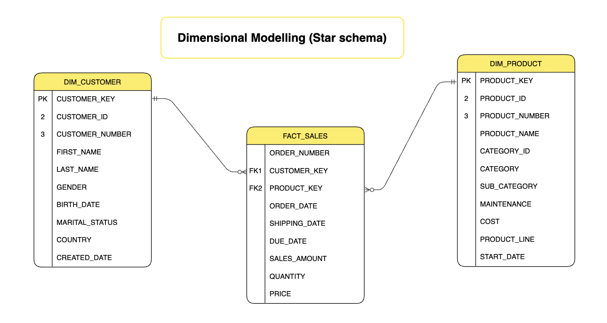

## 🔗 Relationships

- Fact table contains foreign keys referencing dimension tables
- Enables efficient joins and simplified analytical queries

## Slowly Changing Dimensions (SCD Type 2)
- Implemented to track historical changes in dimension data by creating new records instead of updating existing ones
- Preserves both current and historical records for accurate time-based analysis
- The most recent (active) records are identified using an end_date IS NULL condition
- This approach ensures that only current product information is used in analysis, while still retaining historical data for reference

Why It Matters

The star schema improves query performance and simplifies reporting, making it easier to generate insights from large datasets.

---

## Pipeline Orchestration

Purpose:

Pipeline orchestration automates the execution of data processing tasks, ensuring the Bronze, Silver, and Gold layers run in the correct sequence.

** Workflow Design**
- Sequential execution: Bronze → Silver → Gold
- Dependencies ensure each layer runs only after the previous one completes successfully
- Pipeline stops on failure to prevent inconsistent data states

**⏰ Scheduling**
- Configured daily batch execution at 15:00 (Toronto time)
- Ensures consistent and timely data availability
###**Daily runs for 3 consecutive days**
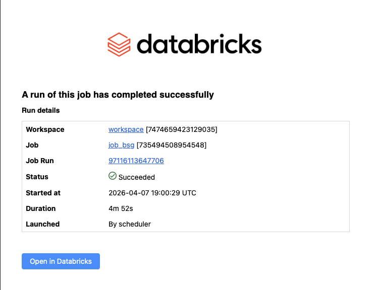
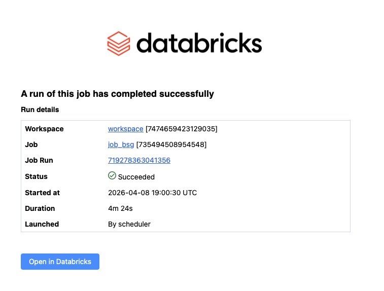
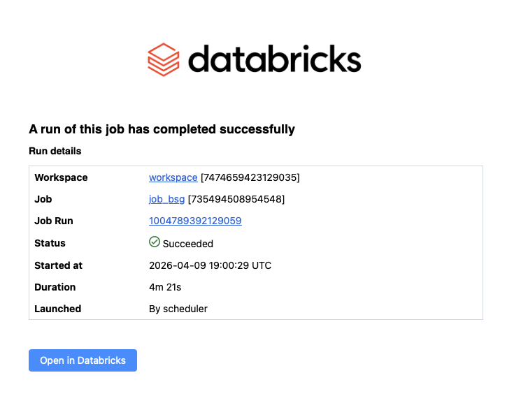

** Pipeline Execution**

A workflow pipeline manages notebook execution, tracks progress, and visualizes dependencies between tasks.

** Key Insight**

Automation ensures consistent and reliable data processing, enabling the timely delivery of analytics-ready datasets with minimal manual intervention.

---

# 📊 Observability & Reliability

This pipeline includes observability and reliability mechanisms to ensure consistent execution, early issue detection, and effective failure handling.

 Logging
- Logged pipeline execution stages (start, success, failure)
- Captured key events during ingestion and transformation
- Enabled traceability for debugging and monitoring

### **Job Run Monitoring and Observabilty**
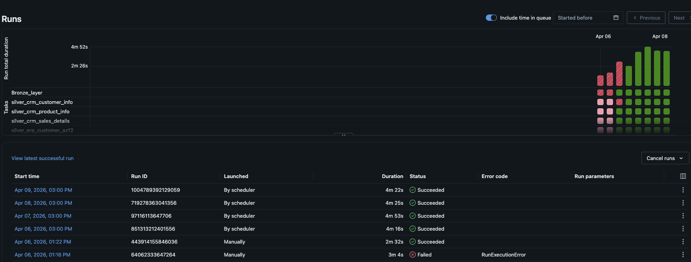

✅ Data Validation Checks
- Verified row counts between layers
- Checked for null values in critical columns
- Validated data types and schema consistency
- Ensured no duplicate records in cleaned datasets

🔁 Retry Logic
- Configured pipeline retries on failure
- Ensured failed stages can be re-executed without affecting upstream data
- Leveraged idempotent design (safe re-runs without duplication)

🚨 Failure Handling
- If the pipeline fails:
- Execution stops at the failed stage
- Failure notifications are triggered (e.g., email alerts)
- Logs are used to identify the root cause
- The pipeline can be safely re-run from the failure point

**Technology Used and programming**
- Python
- Pyspark (Apache spark)
- SparkSQL
- Adavanced SQL
- Lakehouse
- Delta table techonlogy
- Unity Catalog

 
**Tools and Platform**
- Databricks
- GitHub
- Visual Studio Code

**Visual Assets Creation**
- Drawing tools: draw.io → Pipeline architecture, Entity Relationship Diagram, Data flow, Star schema Diagram 
- Screenshots → from notebooks, Databricks pipelines, Email Alerts 

**📌 Acknowledgment**

This project is inspired by publicly available learning resources and uses sample data designed to simulate real-world CRM and ERP systems.

